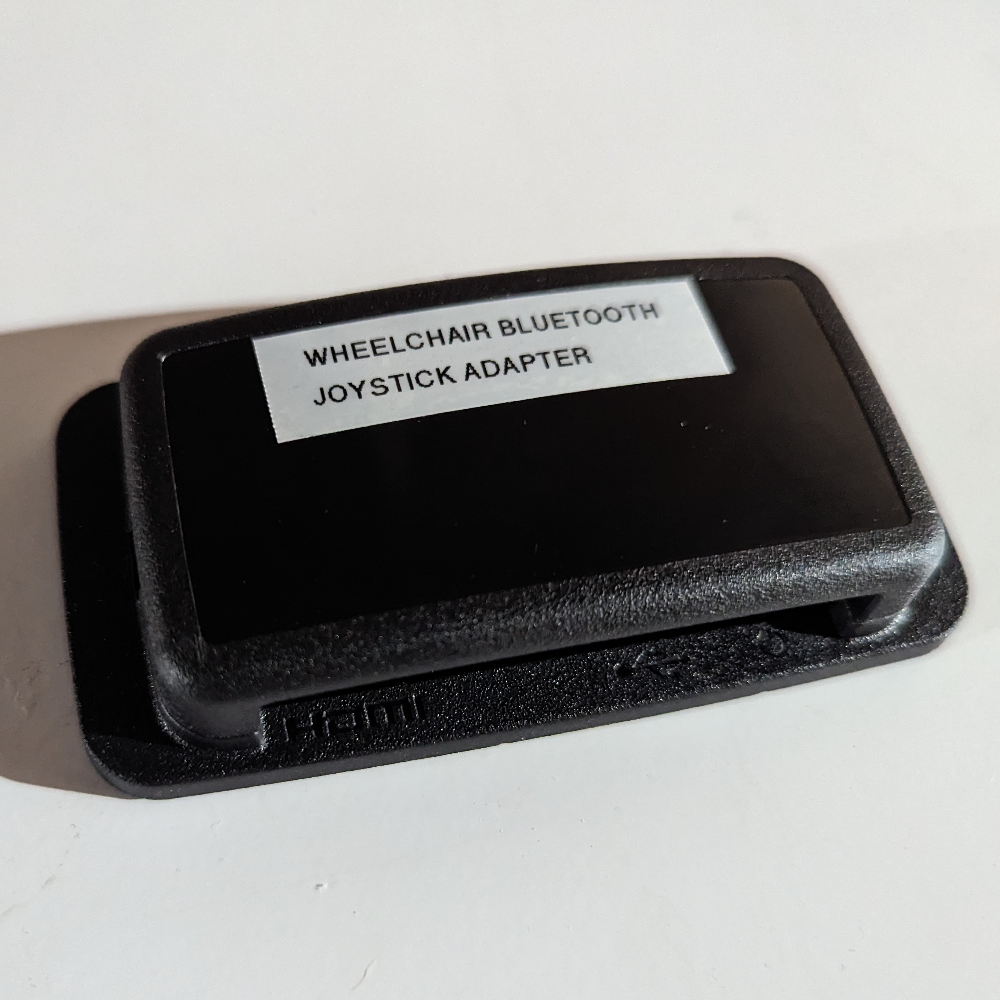

<!-- Open Source Assistive Technology: GitHub Readme Template Version 1.1 (2024-Mar-15) -->
<!-- Template files available at https://github.com/makersmakingchange/OpenAT-Template -->

<!-- TITLE -->
# Wheelchair Bluetooth Joystick Adapter

<!-- SUMMARY -->
The Wheelchair Bluetooth Joystick Adapter is a gaming input solution that enables a user of a powerchair to use their wheelchair joystick that outputs an HID mouse to act as an HID gamepad. The solution requires a powerchair that has a Bluetooth Module that is able to emulate a Bluetooth Mouse. The Wheelchair Bluetooth Joystick Adapter connects to the Bluetooth Module and converts the mouse commands into joystick movement, and then connect via USB to a gaming system.

The Wheelchair Bluetooth Joystick Adapter is based on a [Raspberry Pi](https://www.raspberrypi.com/), a small, affordable single-board computer. The Raspberry Pi is programmed with special code to be able to connect with the Bluetooth module, convert the mouse commands into joystick values, and output the result via USB.

This solution is easy assemble but installing the software does require carefully following a number of steps. All of the components requires are available commercially off-the-shelf. The solution does not require a custom printed circuit board or 3D printed parts. The Raspberry Pi is mounted inside a standard enclosure and connected via USB and any necessary adapter to the gaming system. The intial programming of the Raspberry Pi will require an HDMI display, USB keyboard, and USB mouse, and an internet connection.

The overall cost of materials is about $65 plus $20-25 for component shipping.

The Wheelchair Bluetooth Joystick Adapter is open assistive technology (OpenAT). Under the terms of the open source licenses, the device may be built, used, and improved upon by anyone.

Last updated: 2024-May-06
The latest version (0.1) has been built and tested with a few users. Further development and testing is required. 

## OpenAT Joysticks
This design is part of the [OpenAT Joystick Project](https://github.com/makersmakingchange/OpenAT-Joysticks), a collection of open source designs for digital access and adapted gaming.  

## Compatiblity
### Wheelchair Compatibility
The Wheelchair Bluetooth Joystick Adapter requires that the power chair has a Bluetooth-enabled Joystick, Bluetooth-Enabled Interface, or a Bluetooth Add-on. Refer to the tables below.

#### Bluetooth-Enabled Joysticks

| Joystick Model | Wheelchair Brand |
|---|---|
| Q-Logic 2 | Quantum Rehab |
| Q-Logic 3 | Quantum Rehab |
| LiNX REM400 | Golden Technologies, Drive Medical, Invacare, Merits Health USA |
| R-Net Joystick Module w/Bluetooth (CJSM & PJSM) | Permobil, Quickie | 

#### Bluetooth-Enabled Interfaces
| Interface Model | Wheelchair Brand |
|---|---|
| Q-Logic EX Enhanced Display | Quantum Rehab |
| R-net OMNI 2    |     Permobil, Quickie |
| LiNX REM500 Touch Screen | Golden Technologies, Drive Medical, Invacare, Merits Health USA  | 

#### Bluetooth Add-on Modules

| Module Model | Wheelchair Brand | Joystick Model |
|---|---|---|
| R-net Bluetooth Mouse Module | Permobil, Quickie | R-Net Remote Color Joystick |

### Gaming System Compatiblity
The Wheelchair Bluetooth Joystick Adapter has a USB output. Depending on the gaming system, a third-party adapter may be required. The Wheelchair Bluetooth Joystick Adapter is compatible with the USB inputs on the Xbox Adaptive Controller. The Playstation Access does not have any USB inputs, so the WBJA is not compatible. 

|     Platform    |     Compatibility    |     Additional   Hardware    |     Tested    |
|---|---|---|---|
|     Windows    |     Yes    |     None    |     Yes    |
|     Mac    |     Yes    |     MAGIC NS 2, MAGIC-S PRO 2    |     No    |
|     Android    |     Yes    |     None    |     No    |
|     Xbox    |     Yes    |     Xbox Adaptive Controller    |     Yes    |
|     Nintendo Switch    |     Yes    |     MAGIC NS, MAGIC NS 2, MAGIC-S PRO, MAGIC-S PRO 2, Magic-S   Ultimate    |     No    |
|     PS3    |     Yes    |     MAGIC NS 2, MAGIC-S PRO, MAGIC-S PRO 2, Magic-S Ultimate    |     No    |
|     PS4    |     Yes    |     MAGIC NS 2, MAGIC-S PRO, MAGIC-S PRO 2, Magic-S Ultimate    |     No    |
|     PS5    |     Yes*    |     Xbox Adaptive Controller AND Cronus Zen    |     No    |

*This has not been tested and may not be a long term solution. Check https://www.gamingreadapted.com/xac-ps5 for the latest.

## Usage

### Powerchair Setup
The Bluetooth module on the powerchair must be activated and properly configured. You should be able to connect with a smartphone or computer using Bluetooth and control the mouse cursor.

### Wheelchair Bluetooth Joystick Adapter Initial Bluetooth Pairing
 The initial pairing requires you to access the user interface on the Raspberry Pi to setup the Bluetooth pairing with the powerchair Bluetooth Module. This requires an HDMI display, keyboard, and mouse, or a second computer and a suitable network for a remote desktop connection. Refer to the [User Guide](/Documentation/Wheelchair_Bluetooth_Joystick_Adapter_User_Guide.pdf) for step-by-step instructions.

### Wheelchair Bluetooth Joystick Adapter Setup
1. Connect the Wheelchair Bluetooth Joystick Adapter to the host device / gaming system. Depending on the host device, this may require a third-party adapter and one or more cable adapters.
2. Connect the Wheelchair Bluetooth Joystick Adapter to the power supply.
3. Wait 30-60 seconds for the device to initialize.

### Gaming
Movement of the powerchair joysticks should now be translated to gamepad joystick movement. If the powerchair is configured for left click and right click (e.g., through additional buttons) these will be translated to gamepad button presses.

## How to Obtain the Device
### 1. Do-it-Yourself (DIY) or Do-it-Together (DIT)
This is an open-source assistive technology, so anyone is free to build it. All of the files and instructions required to build the device are contained within this repository. Refer to the Maker Guide below.

<!---
Once a device is in the MMC Library, there are additional ways that this device can be obtained:
### 2. Request a build of this device

You may also submit a build request through the [Makers Making Change Assistive Device Library Listing](<MMCWebLink>) to have a volunteer maker build the device. As the requestor, you are responsible for reimbursing the maker for the cost of materials and any shipping.

### 3. Build this device for someone else

If you have the skills and equipment to build this device, and would like to donate your time to create the device for someone who needs it, visit the [MMC Maker Wanted](https://makersmakingchange.com/maker-wanted/) section.
--->

## Build Instructions

### 1. Read through the Maker Guide

The [Maker Guide](/Documentation/Wheelchair_Bluetooth_Joystick_Adapter_Maker_Guide.pdf) contains all the necessary information to build this device, including tool lists, assembly instructions, programming instructions (if applicable) and testing.

### 2. Order the Off-The-Shelf Components

The [Bill of Materials](/Documentation/Wheelchair_Bluetooth_Joystick_Adapter_BOM.xlsx) lists all of the parts and components required to build the device.

### 3. Assemble the Wheelchair Bluetooth Joystick Adapter

Reference the [Maker Guide](/Documentation/Wheelchair_Bluetooth_Joystick_Adapter_Maker_Guide.pdf) for the steps required to assemble and program the device.

## How to improve this Device
As open source assistive technology, you are welcomed and encouraged to improve upon the design. 

## Files
### Documentation
| Document             | Version | Link |
|----------------------|---------|------|
| Maker Guide          | 0.1     | [Wheelchair Bluetooth Joystick Adapter Maker Guide](/Documentation/Wheelchair_Bluetooth_Joystick_Adapter_Maker_Guide.pdf)     |
| Bill of Materials    | 0.1     | [Wheelchair Bluetooth Joystick Adapter Bill of Materials](/Documentation/Wheelchair_Bluetooth_Joystick_Adapter_BOM.xlsx)     |
| User Guide           | 0.1     | [Wheelchair Bluetooth Joystick Adapter User Guide](/Documentation/Wheelchair_Bluetooth_Joystick_Adapter_User_Guide.pdf)    |
| Changelog            | 0.1     | [Changelog](CHANGES.txt)     |

<!---
| Design Rationale     | 0.1     | [Wheelchair Bluetooth Joystick Adapter Design Rationale](/Documentation/Wheelchair_Bluetooth_Joystick_Adapter_Design_Rationale.pdf)     |
| Maker Guide          | 0.1     | [Wheelchair Bluetooth Joystick Adapter Maker Guide](/Documentation/Wheelchair_Bluetooth_Joystick_Adapter_Maker_Guide.pdf)     |
| Changelog            | 0.1     | [Changelog](CHANGES.txt)     |
--->

<!-- DESIGN FILES -->
### Design Files
This device does not require any custom hardware, printed circuit boards, or 3D prints.
<!---
 - [CAD Files](/Design_Files/CAD_Design_Files)
 - [PCB Files](/Design_Files/PCB_Design_Files)
 --->

<!-- BUILD FILES -->
### Build Files
<!--- - [3D Printing Files](/Build_Files/3D_Printing_Files) --->
<!--- - [PCB Build Files](/Build_Files/PCB_Build_Files) --->
<!--- - [Firmware Files](/Build_Files/Firmware_Files) --->
 - [Software Files](/Build_Files/Software_Files)

<!-- ATTRIBUTION -->
## Attribution

The bulk of this solution was developed by Milad Ha as part of his [BlueStick](https://github.com/milador/BlueStick) project, a gaming input solution based on Raspberry Pi hardware which allows input devices such as HID keyboard and HID mice devices to act as HID gamepad. This code is released under an MIT license. 

The documentation template was created by Makers Making Change / Neil Squire Society and is used under a CC BY-SA 4.0 license. It is available at the following link: [https://github.com/makersmakingchange/OpenAT-Template](https://github.com/makersmakingchange/OpenAT-Template)

<!-- CONTRIBUTORS -->
### Contributors

 - Milad Ha, Neil Squire Society. Software development and testing.
 - Derrick Andrews, Neil Squire Society. Testing.
 - Jake McIvor, Neil Squire Society. Testing and documentation.
 - Josie Versloot, Neil Squire Society. Testing and documentation.
 - Matthew Hutchinson, University of PEI. Latency testing.
 - Riley Fitzpatrick, Univerity of PEI. Latency Testing.

<!-- LICENSE -->
## License

Copyright (c) 2023-2024 Neil Squire Society

This repository describes Open Hardware:
- All software is under the [MIT License]
 - Accompanying material such as instruction manuals, videos, and other copyrightable works that are useful but not necessary to design, make, test, or prepare the Wheelchair Bluetoothj Joystick Adapter are published under a [Creative Commons Attribution-ShareAlike 4.0 license (CC BY-SA 4.0)](https://creativecommons.org/licenses/by-sa/4.0/) .

Permission is hereby granted, free of charge, to any person obtaining a copy of this software and associated documentation files (the "Software"), to deal in the Software without restriction, including without limitation the rights to use, copy, modify, merge, publish, distribute, sublicense, and/or sell copies of the Software, and to permit persons to whom the Software is furnished to do so, subject to the following conditions:

The above copyright notice and this permission notice shall be included in all copies or substantial portions of the Software.

THE SOFTWARE IS PROVIDED "AS IS", WITHOUT WARRANTY OF ANY KIND, EXPRESS OR IMPLIED, INCLUDING BUT NOT LIMITED TO THE WARRANTIES OF MERCHANTABILITY, FITNESS FOR A PARTICULAR PURPOSE AND NONINFRINGEMENT. IN NO EVENT SHALL THE AUTHORS OR COPYRIGHT HOLDERS BE LIABLE FOR ANY CLAIM, DAMAGES OR OTHER LIABILITY, WHETHER IN AN ACTION OF CONTRACT, TORT OR OTHERWISE, ARISING FROM, OUT OF OR IN CONNECTION WITH THE SOFTWARE OR THE USE OR OTHER DEALINGS IN THE SOFTWARE.

Source Location: <https://github.com/makersmakingchange/Wheelchair-Bluetooth-Adapter> 

---

<!-- ABOUT MMC START -->
## About Makers Making Change

Makers Making Change is a program of [Neil Squire](https://www.neilsquire.ca/), a Canadian non-profit that uses technology, knowledge, and passion to empower people with disabilities.

Makers Making Change leverages the capacity of community based Makers, Disability Professionals and Volunteers to develop and deliver affordable Open Source Assistive Technologies.

 - Website: [www.MakersMakingChange.com](https://www.makersmakingchange.com/)
 - GitHub: [makersmakingchange](https://github.com/makersmakingchange)
 - Bluesky: [@makersmakingchange.bsky.social](https://bsky.app/profile/makersmakingchange.bsky.social)
 - Instagram: [@makersmakingchange](https://www.instagram.com/makersmakingchange)
 - Facebook: [makersmakechange](https://www.facebook.com/makersmakechange)
 - LinkedIn: [Neil Squire Society](https://www.linkedin.com/company/neil-squire-society/)
 - Thingiverse: [makersmakingchange](https://www.thingiverse.com/makersmakingchange/about)
 - Printables: [MakersMakingChange](https://www.printables.com/@MakersMakingChange)

### Contact Us
For technical questions, to get involved, or to share your experience we encourage you to [visit our website](https://www.makersmakingchange.com/) or [contact us](https://www.makersmakingchange.com/s/contact).
<!-- ABOUT MMC END -->
